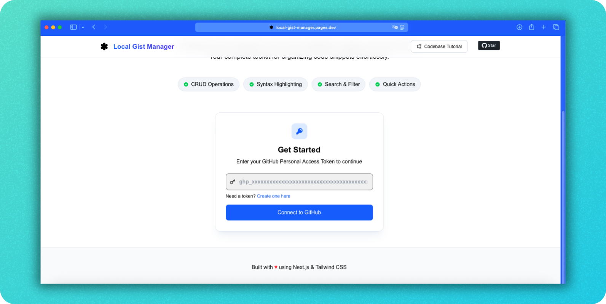
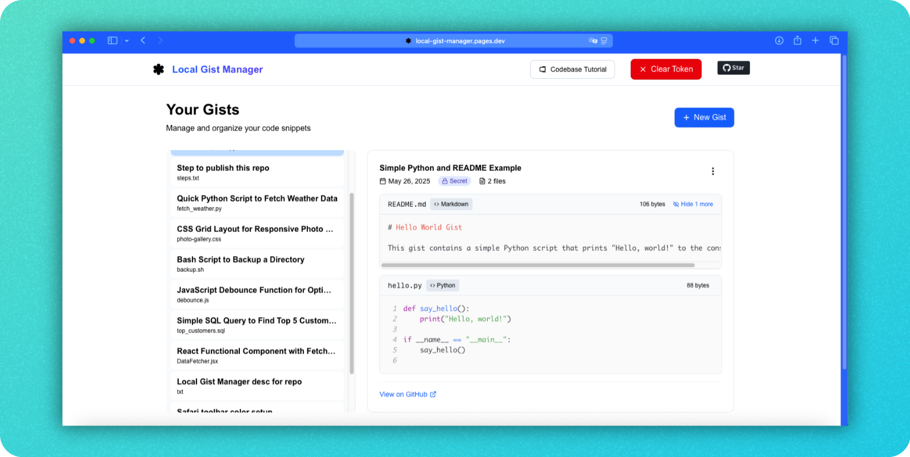
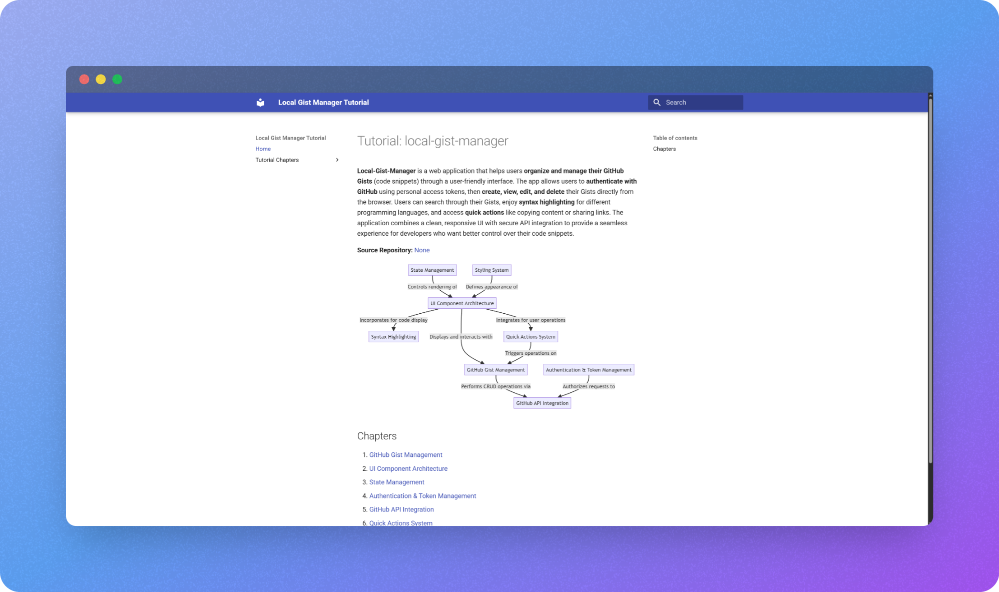

# Local Gist Manager

A modern, minimal Next.js app for managing your GitHub Gists locally with a beautiful UI, built for Cloudflare Pages deployment.





> **⚠️ Suggestion:**
> This project is for local use and experimentation. I advise you **not to deploy it on the public Internet**—just play with it on your local machine. :)

 
## 🏆 Best Practices for Using Local Gist Manager

This project is designed for local experimentation. To use it securely and effectively, please follow these best practices:

1. **Create a New Personal Access Token (Classic) with Least Privilege**  
   Generate your GitHub token at [https://github.com/settings/tokens/new](https://github.com/settings/tokens/new) by selecting **Personal Access Tokens (classic)**.  
   - Give it a descriptive name.  
   - Set an expiration date to enhance security.  
   - **Select only the `gist` checkbox with "Create gists" permission** to follow the principle of least privilege.  
   - Copy the token; you won’t be able to see it again after leaving the page.

2. **Do Not Store Credentials or Sensitive Data in Your Gists**  
   Avoid placing any personal credentials, tokens, or sensitive information inside your gists to prevent accidental exposure.

3. **Use the App Locally and Avoid Public Deployment**  
   Since the app manages your GitHub token, it is safer to run it locally or on trusted private environments like Cloudflare Pages with proper environment variable configurations.

4. **Manage Your Token Securely**  
   Use the app’s token management feature to set or clear your token as needed. Never commit your token to version control or share it publicly.

By adhering to these practices, you minimize security risks and ensure a smooth, secure experience managing your GitHub Gists locally.


---

## 📚 One-day Complete Project Series


## ✨ Features

| Feature                | Description                                                                 |
|------------------------|-----------------------------------------------------------------------------|
| 🗂️ Gist List           | View all your GitHub Gists in a clean, sortable list                         |
| 📄 Multi-file Support  | See all files in a gist by default, with syntax highlighting                  |
| 📝 Create/Edit/Delete  | Full CRUD for your Gists (with GitHub token)                                 |
| 🔑 Token Management    | Easily set or clear your GitHub token from the header                        |
| 💡 Codebase Tutorial   | Quick access to a codebase walkthrough with a single click                   |
| 🎨 Modern UI           | Responsive, accessible, and visually appealing design                        |
| ☁️ Cloudflare Ready (Optional)    | Optimized for Cloudflare Pages, no Node.js built-in dependencies required     |

---

## 🚀 Quick Start

```bash
# Install dependencies
npm i

# Run locally
npm run dev

# Build for Cloudflare Pages
npm run build && npx @cloudflare/next-on-pages
```

> **Reminder:**
> - In Cloudflare Pages, set the environment variable `NODE_VERSION` to at least `18.18.0`.
> - Set Compatibility flags: `nodejs_compat`.


---

## 🐳 Quick Start with Docker

To run this app using Docker, use the following command:

```powershell
docker run -d -p 3000:3000 paulkit41/local-gist-manager
```

- The app will be available at [http://localhost:3000](http://localhost:3000).
- Optionally, you can add your GitHub token as an environment variable:

```powershell
docker run -d -p 3000:3000 -e NEXT_PUBLIC_GITHUB_TOKEN=your_github_token paulkit41/local-gist-manager
```

---

## 🛠️ Tech Stack

- [Next.js 15+](https://nextjs.org/)  
- [React 19](https://react.dev/)  
- [Tailwind CSS 4](https://tailwindcss.com/)  
- [Cloudflare Pages](https://pages.cloudflare.com/)  
- [Lucide Icons](https://lucide.dev/icons/)  

---

## 🔒 Authentication

- Uses a GitHub personal access token (PAT) for gist management.
- Token can be set/cleared from the header at any time.

---

## 🌐 Deployment on Cloudflare Pages (Optional)

1. Fork this repo / Download files manually.
2. Connect the repo to Cloudflare Pages / Use direct upload.
3. Set build command:  
   `npm run build && npx @cloudflare/next-on-pages`
4. Set output directory:  
   `.vercel/output/static`

---

## 📦 License

MIT

